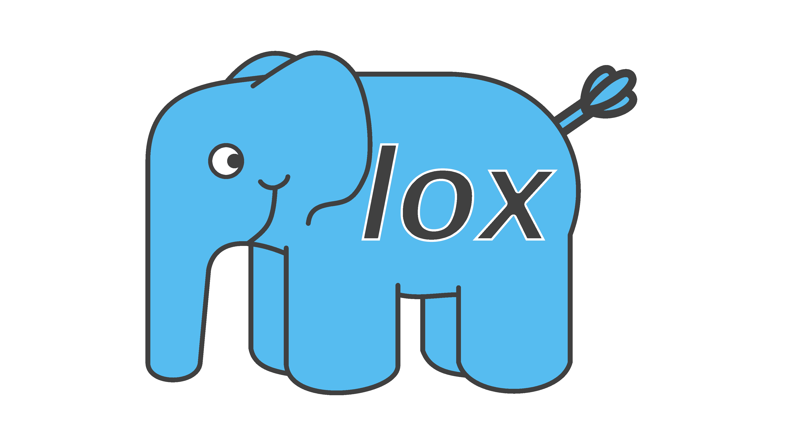

# LoxoGOnta

A [Lox](https://craftinginterpreters.com/the-lox-language.html) interpreter written in Go with no external dependencies



> Lox => lat. *Loxodonta* => eng. *elephant*
> > No relation to PHP whatsoever, It's just the first elephant I thought of

The book follows some advanced OOP design patters. Go does support OOP and so I could have implemented them in the same way, but I chose to challenge myself with a purely procedural solution.

## Prerequisites

- [Go](https://go.dev).

## Installation

To set up the project:

```bash
git clone https://github.com/ikugo-dev/loxogonta.git
cd loxogonta
```

### REPL:

```bash
go run cmd/loxogonta/main.go
```

### Running scripts:

```bash
go run cmd/loxogonta/main.go [path/to/script.lox]
```
